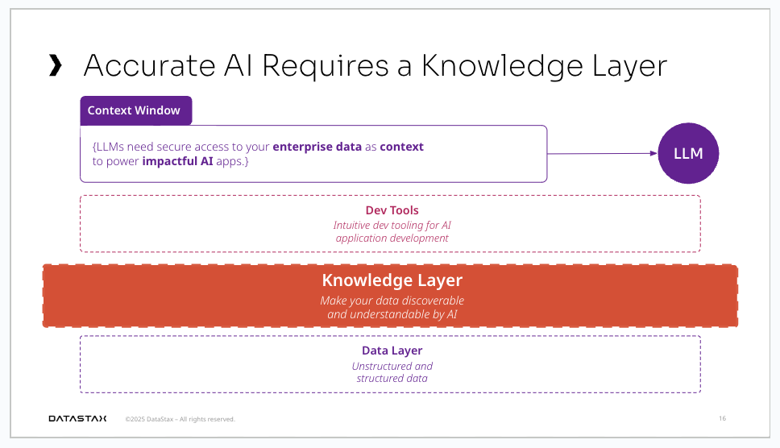
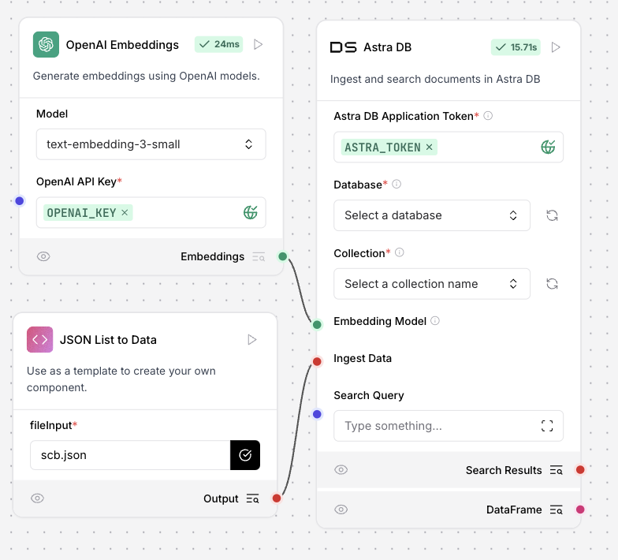
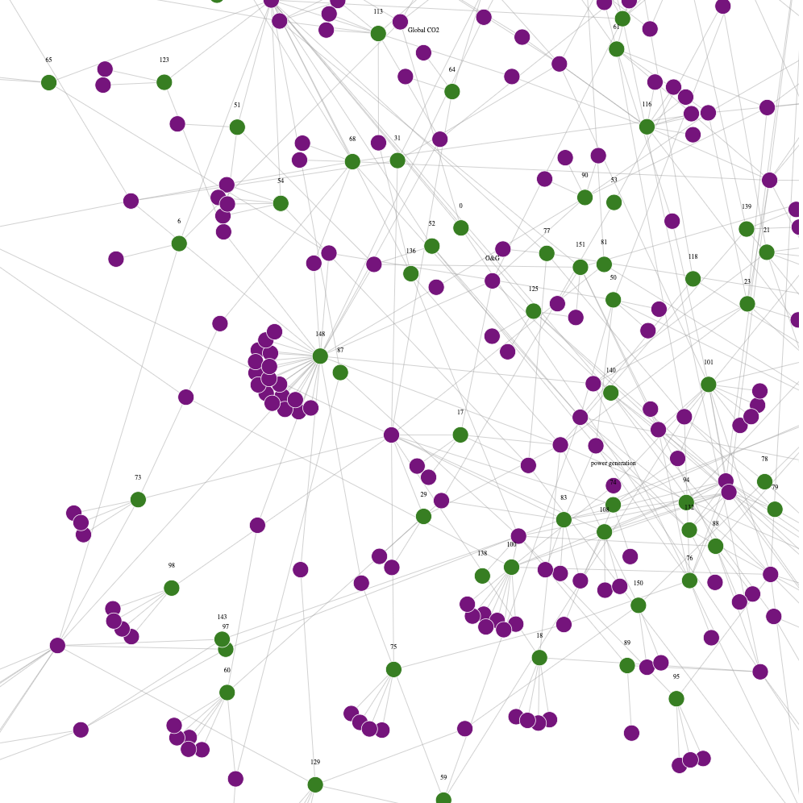

# Knowledge Layer in AstraDB



- Knowledge layer is key for Accurate AI. 
- Knowledge layer is more than Vector search.
- You need Vector + Graph + Hybrid search

Here we demonstrate how to easily build knowledge layer from complex unstructured data on AstraDB

## Data Preparation / Chunking

Do you have a complex PDF, with tables, graphics, mixed layout? 

Multi-Modal LLMs makes it really easy to parse and chunk these complex docs [[1]](#references)

Try it out [[2]] (#references)
```
python parse.py <filename>
```

This will produce a `out.json` in this format

```
[
              {
                "chunk": "chunk1",
                "metadata": {
                  "entities": ["entity1", "entity2"],
                  "topics": ["topic1", "topic2"]
                }
              },
              {
                "chunk": "chunk2",
                "metadata": {
                  "entities": ["entity3", "entity4"],
                  "topics": ["topic3", "topic4"]
                }
              }
            ]
```

## Create Knowledge Layer

There are several ways to ingest the above json to AstraDB. If you prefer to use [langflow](https://www.langflow.org/), I have created a component `custom_component.py` [[3]](#references)

Copy paste the code to custom component. Flow should be very simple like this


That's it, That's all is needed! now you can do Semantic Searches with Vector, combine that with hybrid search, build a [Dynamic Graph](https://github.com/datastax/graph-rag) at query time! 

## Vector 
- Homework, checkout Agents in Langflow on how you can use them

## Graph
How are we able to create a dynamic graph using this data at query time?
Simple, its in the metadata.

Let's first visualize it [[4]](#references) 

``` 
python -m http.server 8000
```

visit - `http://localhost:8000/d3.html` 

You should see something like this,


Now, how can you use it for retrieval in RAG, check out `retriever.py`

```
retriever = GraphRetriever(
    store = vector_store, # langchain astradb vector store
    edges = [("metadata.entities", "metadata.entities")],
    strategy = Eager(k=10,start_k=3,max_depth=2),
)
```
(langflow component coming soon!)

Hope this helps demonstrates how easy it is to build a Knowledge layer in AstraDB

## References
[1] - https://www.sergey.fyi/articles/gemini-flash-2 

[2] - `parse.py` generated by `o3-mini-high` by the following start prompt and some [vibe coding](https://x.com/karpathy/status/1886192184808149383)
```
Write a code that accepts a pdf file as input, parses the pdf file, convert each page to a image, use gemini flash 2.0 to OCR the following page into Markdown. 

Tables should be formatted as HTML. Do not sorround your output with triple backticks. Chunk the document into sections of roughly 250 - 1000 words. Our goal is to identify parts of the page with same semantic theme. These chunks will be embedded and used in a RAG pipeline. 

Return chunks as json, with chunk and followed by metadata that includes some key entities and topics referenced by the chunk
```

[3] - `custom_component.py`. failed to create a fully working code with `o3-mini-high`, but atleast got the main part of the code correct

```
    def build_output(self) -> list[Data]:        
        with open(self.fileInput, "r") as f:
            content = f.read()            
            data = json.loads(content)            
            ret = [Data(text=d.get("chunk", ""), metadata=d.get("metadata", {})) for d in data]
        return ret
```

[4] - this viz was created by o3-mini with the following start prompt 
```
i want to create a force directed graph based on d3js for the following data model

for each chunk have edges to the metadata.entities specified 

Check can be green circle
Entities can be a purple circle

When clicked on entities show the entity name as a label

for chunk just show the index position of the array

data will be available in a json file
---

[
              {
                "chunk": "chunk1",
                "metadata": {
                  "entities": ["entity1", "entity2"],
                  "topics": ["topic1", "topic2"]
                }
              }
]
```